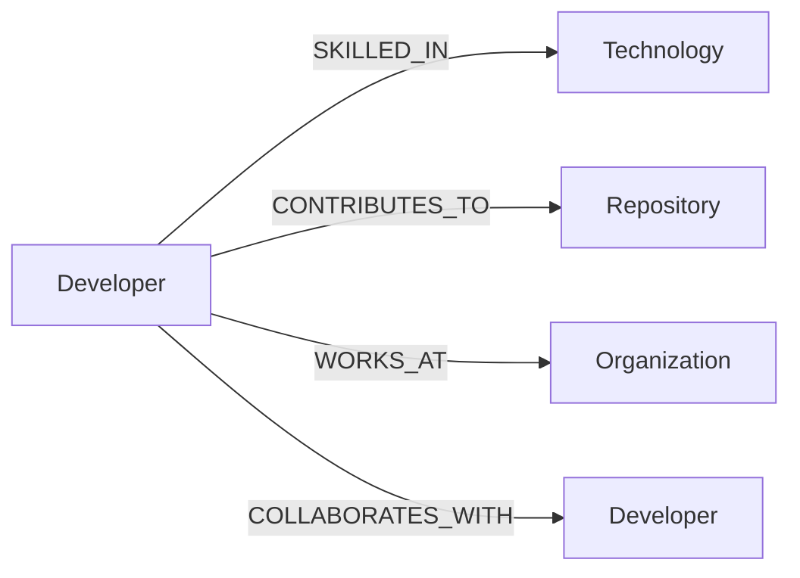

# DevGraph — Developer Network Explorer

A graph database application for exploring developers, their skills, repositories, organizations, and collaboration networks — built on **CognoDB** (openCypher over Bolt).

**Live demo:** _[add hosted link here]_
**Screen recording:** _[add link here]_

---

## Why a Graph Database?

This use case is fundamentally about **connections**, not rows:

- *"Who should I collaborate with next?"* requires walking 2+ hops through a collaboration network — a self-join at increasing depth in SQL, a single chained pattern in Cypher.
- *"Find developers connected to my network, but not directly connected to me"* is an anti-join over a recursive relationship — awkward and slow to express relationally, trivial in Cypher.
- The schema itself has no natural "main table" — a developer is equally defined by their skills, repos, org, and collaborators. Modeling this in SQL means five+ join tables for what a graph represents natively as labeled edges.

As the network grows, relational JOINs get slower and the query gets harder to read. Graph traversals stay close to constant-time per hop and read like the question being asked.

---

## Data Model

**Nodes:** `Developer`, `Technology`, `Repository`, `Organization`

**Relationships:**
| Relationship | Direction | Key Properties |
|---|---|---|
| `SKILLED_IN` | Developer → Technology | `proficiency`, `yearsUsing` |
| `CONTRIBUTES_TO` | Developer → Repository | `commits`, `role` |
| `WORKS_AT` | Developer → Organization | `position` |
| `COLLABORATES_WITH` | Developer ↔ Developer | `projects` |




### 3. Seed the database
```bash
npm install
node seed_data.js
```
Safe to re-run — it wipes existing data before reseeding.

### 4. Run the app
```bash
# backend
node src/server.js       # http://localhost:3000

# frontend (separate terminal)
cd frontend
npm install
npm run dev         # http://localhost:5173
```

---

## Main Queries

**1. Collaborator Recommendations (2-hop traversal, SQL-awkward)**
Finds developers reachable through a mutual collaborator, excluding people already directly connected — ranked by shared technologies.
```cypher
MATCH (me:Developer {username: $username})-[:COLLABORATES_WITH]->(:Developer)
      -[:COLLABORATES_WITH]->(candidate:Developer)
WHERE candidate <> me
  AND NOT (me)-[:COLLABORATES_WITH]->(candidate)
OPTIONAL MATCH (me)-[:SKILLED_IN]->(shared:Technology)<-[:SKILLED_IN]-(candidate)
RETURN candidate, collect(DISTINCT shared.name) AS sharedTech
ORDER BY size(sharedTech) DESC
```
This requires a self-join at depth 2 plus a `NOT EXISTS` anti-join in SQL — two chained relationship patterns here.

**2. Developer Profile (1-hop fan-out)**
Gathers skills, repos, org, and collaborators for one developer in a single query via parallel `OPTIONAL MATCH` clauses.

**3. Graph Snapshot**
Returns all nodes and relationships (bounded by `limit`) for the interactive visualization.

**4. Developer List/Search**
Case-insensitive name/username filter powering the landing page.

---

## Engineering Notes

- All queries use parameterized Cypher (`$param`) via the official `neo4j-driver` — no string concatenation.
- Connection credentials are read from environment variables (`.env`, gitignored) — never committed.
- API returns `503` with a clear message when CognoDB is unreachable, rather than crashing.
- Frontend: React + Vite + Tailwind, no router — single `App.jsx` with state-based view switching (list → profile → graph).
- Graph visualization: `react-force-graph-2d`, color-coded by node label, draggable/zoomable.

---

## Project Structure
```
backend/
  seed.js
  src/
    controllers/developerscontroller.js
    routes/developerRoutes.js
    server.js
frontend/
  src/App.jsx
```

---

## Screenshots

_[Add screenshots of: developer list, profile page, network graph]_
